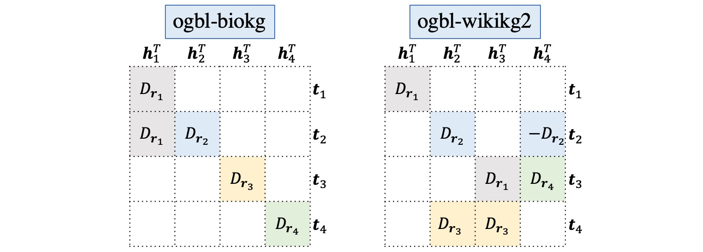

# AutoSF-OGB

The scoring functions are searched by the paper ["AutoSF: Searching Scoring Functions for Knowledge Graph Embedding"](https://arxiv.org/pdf/1904.11682.pdf), which has been published in ICDE 2020, based on the [code](https://github.com/AutoML-4Paradigm/AutoSF). The evaluation implementation of AutoSF is customized for [Open Graph Benchmark (OGB)](https://ogb.stanford.edu/) datasets ([ogbl-biokg](https://ogb.stanford.edu/docs/leader_linkprop/#ogbl-biokg) and [ogbl-wikikg2](https://ogb.stanford.edu/docs/leader_linkprop/#ogbl-wikikg2)) based on [OGB examples](https://github.com/snap-stanford/ogb/tree/master/examples/linkproppred). Thanks for their contributions.

## Introduction to AutoSF
Given the embeddings, we evenly split them into 4 chunks.

```
h = [h1; h2; h3; h4]
r = [r1; r2; r3; r4]
t = [t1; t2; t3; t4]
```

Then the optimal scoring functions searched on each dataset are formed as

```
for biokg dataset,   
f(h,r,t) = <h1,r1,t1> + <h1,r1,t2> + <h2,r2,t2> + <h3,r3,t3> + <h4,r4,t4> 

for wikikg2 dataset, 
f(h,r,t) = <h1,r1,t1> + <h2,r2,t2> + <h3,r1,t3> - <h4,r2,t2> + <h2,r2,t3> + <h3,r3,t4> + <h4,r4,t3>
```

which can be graphically illustrated as follows:



with D<sub>ri</sub> = diag(ri).

## Usage

### Setup
Requirements
- pytorch >= 1.7.1
- ogb >= 1.2.4

### Run examples
```
# in each folder for specific dataset
sh examples.sh
```


## Results on OGB

### ogbl-biokg dataset
| Model | #Dim | #Parameters | Hardware| Test MRR | Valid MRR |
|:------:|:------:|:------:|:------:|:--------:|:--------:|
| AutoSF | 1000 | 93,824,000 | GeForce RTX 2080 11G | 0.8309 ± 0.0008 | 0.8317 ± 0.0007 |
| AutoSF | 2000 | 187,648,000 | GeForce RTX 2080 11G | 0.8320 ± 0.0007 | 0.8327 ± 0.0006 |

### ogbl-wikikg2 dataset
| Model | #Dim | #Parameters | Hardware| Test MRR | Valid MRR |
|:------:|:------:|:------:|:------:|:--------:|:--------:|
| AutoSF | 100 | 250,113,900 | GeForce RTX 2080 11G | 0.5186 ± 0.0065 | 0.5239 ± 0.0074 |
| AutoSF | 200 | 500,227,800 | Quadro RTX 8000 45G | 0.5458 ± 0.0052 | 0.5510 ± 0.0063 |


### Tuned hyper-parameters
| name | biokg | wikikg2 |
|:------:|:------:|:------:|
| learning rate | [1e-4, 3e-4, 1e-3, 3e-3, 1e-2] | [1e-4, 3e-4, 1e-3, 3e-3, 1e-2] |
| L2 regularization | [1e-7, 3e-7, 1e-8, 3e-8, 1e-6] | [1e-7, 3e-7, 1e-8, 3e-8, 1e-6] |
| gamma | [50, 100, 200] | [50, 100, 200] |
| batch_size | [1024, 2048] | [1024, 2048] |
| embedding dimension | [1000, 2000] | [100, 200] |
| #negative samples | [64, 128, 256, 512, 1024] | [64, 128, 256, 512, 1024] |
| adversarial temperature | [0.2, 0.5, 1, 1.5, 2, 3] | [0.2, 0.5, 1, 1.5, 2, 3] |


## Citation
Readers are welcomed to fork this repository to reproduce the experiments and follow our work. Please kindly cite our paper

    @inproceedings{zhang2019autosf,
      title={AutoSF: Searching Scoring Functions for Knowledge Graph Embedding},
      author={Zhang, Yongqi and Yao, Quanming and Dai, Wenyuan and Chen, Lei},
      booktitle={2020 IEEE 36th International Conference on Data Engineering (ICDE)},
      pages={433--444},
      year={2020},
      organization={IEEE}
    }
    
## Acknowledgement
    This repository is developed by [Zhanke Zhou](https://github.com/AndrewZhou924) as an intern at 4Paradigm Inc. mentored by [Yongqi Zhang](https://yzhangee.github.io/).
